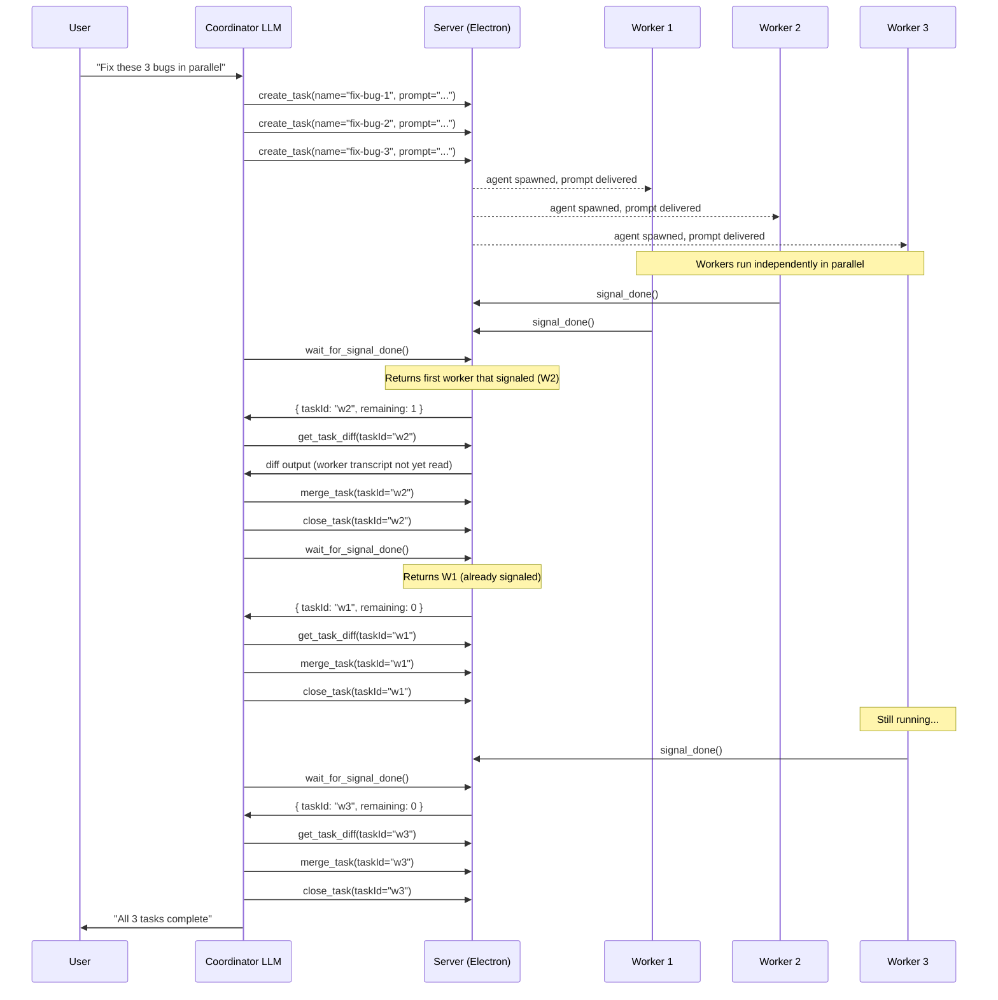
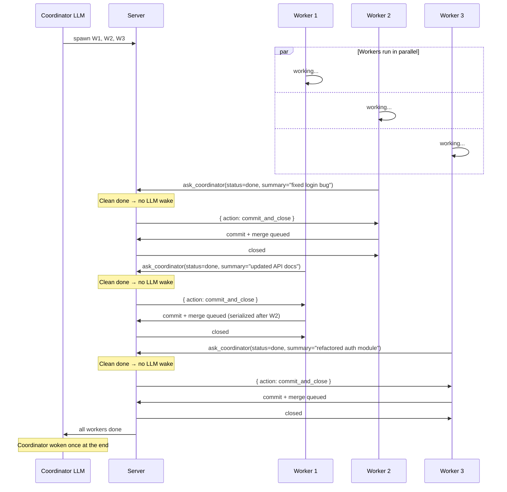
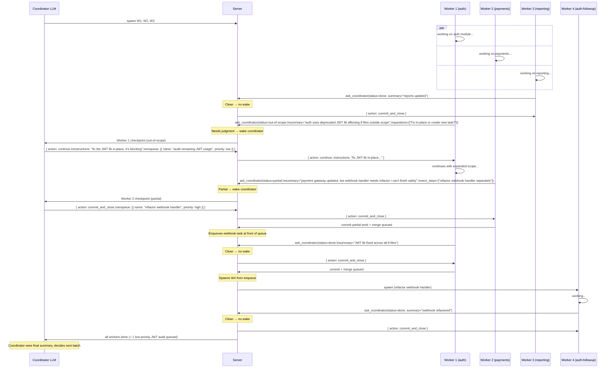

# Ask-Coordinator Protocol: Worker Checkpoint with Sync Response

## Summary

Parallel Code's coordinator feature lets a single Claude agent orchestrate many
worker agents in parallel — spawning tasks, waiting for completions, merging
branches, and keeping the user out of the loop. It works well up to about 3
concurrent workers. Beyond that, a structural bottleneck kicks in: the coordinator
LLM must personally review and close every completed worker before it can do
anything else, so worker slots sit idle while the coordinator catches up. The
pipeline stalls.

This proposal adds a second MCP tool for workers: `ask_coordinator`. Workers
call it mid-task when they need a decision — partial result, blocked, or
out-of-scope discovery — and get a synchronous response with instructions. When
they're genuinely done, they still call `signal_done`, which the server handles
mechanically without ever waking the coordinator LLM. The coordinator is only
consulted when judgment is genuinely needed.

The result: clean completions are free, the coordinator stays ahead of its queue,
and the practical worker limit scales from ~3 to as many workers as the machine
can run. Token usage drops proportionally — a batch of 10 workers where 8 finish
cleanly costs the coordinator 2 reviews instead of 10.

---

## Terminology

| Term            | Definition                                                                                                                                                              |
| --------------- | ----------------------------------------------------------------------------------------------------------------------------------------------------------------------- |
| **Coordinator** | A Claude agent task that orchestrates work. Has access to the full coordinator MCP tool set. Spawns and manages workers.                                                |
| **Worker**      | A Claude agent task spawned by a coordinator to perform a scoped unit of work. Has access to only one MCP tool: `signal_done`. Also called "sub-task" in internal code. |
| **Server**      | The MCP/HTTP server embedded in the Electron app. Routes tool calls, manages task state, and serializes merges. Not an LLM — deterministic code.                        |
| **Task**        | A unit of work in the Parallel Code UI: one git worktree, one agent process, one panel. A coordinator is a task; each worker is a task.                                 |
| **Agent**       | The Claude LLM process running inside a task's terminal (via node-pty). The coordinator agent and worker agents are separate Claude processes.                          |
| **Worktree**    | A git worktree checked out from the base branch for a task. Each worker gets its own isolated worktree so they can work in parallel without filesystem conflicts.       |
| **Merge queue** | Server-side serialization that ensures only one worker's branch merges into base at a time, preventing concurrent rebase collisions.                                    |
| **MCP tool**    | A structured function call the Claude agent can make to the server. Defined in `electron/mcp/mcp-tool-list.ts`.                                                         |

---

## Current State

### Architecture overview

The coordinator system has two roles: **coordinator** and **worker** (called "sub-task" internally). Each role gets a different set of MCP tools injected into its Claude agent at startup. The tools are served over a local MCP/HTTP server embedded in the Electron app.

#### Coordinator MCP tools

| Tool                    | Purpose                                                                                                                  |
| ----------------------- | ------------------------------------------------------------------------------------------------------------------------ |
| `create_task`           | Spawn a new worker with a git worktree and initial prompt                                                                |
| `list_tasks`            | List all coordinated tasks and their status                                                                              |
| `get_task_status`       | Get detailed status of one task (git info, agent state)                                                                  |
| `send_prompt`           | Send a follow-up instruction to a running worker's agent                                                                 |
| `wait_for_idle`         | Block until a worker's agent is at its prompt (ready for input)                                                          |
| `get_task_output`       | Read recent terminal output from a worker (ANSI stripped)                                                                |
| `get_task_diff`         | Get changed files and unified diff for a worker's branch                                                                 |
| `merge_task`            | Merge a worker's branch into base branch                                                                                 |
| `close_task`            | Kill agent, remove worktree and branch                                                                                   |
| `wait_for_signal_done`  | Block until ANY worker calls `signal_done`; returns `{ taskId, remaining }`                                              |
| `review_and_merge_task` | _(already deprecated)_ Merge immediately without diff review — use `get_task_diff` → `merge_task` → `close_task` instead |

#### Worker MCP tools

| Tool          | Purpose                                                                                 |
| ------------- | --------------------------------------------------------------------------------------- |
| `signal_done` | Signal that assigned work is complete; server commits, merges, and closes automatically |

Workers have exactly one tool today. They cannot query their own status, list siblings, or communicate anything beyond "I'm done." In particular, they have no way to surface blockers or scope discoveries without just stopping silently.

### Current interaction flow



The merge serialization (`merge_task` calls are sequential) already prevents concurrent rebases. The coordinator LLM is the bottleneck: it must wake, read the diff, decide, and act for every single completion — including clean ones.

### What works well

- **Parallel execution**: coordinator spawns N workers and they run concurrently with no coordinator involvement until `signal_done`.
- **Any-worker semantics**: `wait_for_signal_done` returns whichever worker finishes first, so the coordinator processes completions as they arrive rather than waiting for a specific task.
- **Merge serialization**: `merge_task` calls are already serialized server-side, preventing the rebase-on-rebase collision problem.
- **Full hands-off lifecycle**: startup, git worktree creation, and cleanup are all managed without user involvement.

In practice a coordinator successfully drives 3 concurrent workers through start → work → commit → merge → close with no human intervention. Scale beyond that is where the current design breaks down (see below).

### What needs improvement

#### 0. Scale cap: ~3 concurrent workers in practice

**This is the primary motivation for this design change.**

In observed usage, the coordinator reliably manages 3 concurrent workers but
struggles beyond that. The root cause is the coordinator LLM being on the
critical path for every completion:

1. Worker A finishes and calls `signal_done`. Coordinator LLM wakes, reads diff,
   calls `merge_task`, calls `close_task`.
2. While the coordinator is processing A, workers B and C also finish and call
   `signal_done`. They queue up.
3. The coordinator must now process B and C sequentially before it can spawn any
   new work. Each review takes time (reading diffs, making decisions, issuing tool calls).
4. Meanwhile, all worker slots sit idle. Throughput collapses.

With 5+ workers the coordinator spends more time processing completions than
workers spend doing actual work. The pipeline stalls.

The completion-review bottleneck means **adding more workers past ~3 produces
diminishing returns** — and can actually slow total throughput if the coordinator
falls behind its own queue.

#### 1. Binary `signal_done` — no status communication

`signal_done` is a one-bit signal. The worker cannot express:

- "I'm done and everything is clean."
- "I completed 60 % of the work and stopped at a decision boundary."
- "I found something outside my scope — should I fix it?"
- "I'm blocked on a missing credential."

The coordinator wakes up and has to infer status from the terminal transcript, which is expensive (many tokens) and unreliable.

#### 2. Coordinator LLM on the critical path for clean completions

Even when a worker finishes cleanly, the coordinator LLM must wake up, read the
transcript, decide to commit and close, and move on. This wastes tokens on
mechanical decisions and caps throughput: the coordinator can only process one
completion at a time.

#### 3. Workers that discover scope expansions go silent

If a worker finds that the right fix touches files outside its assigned scope, it
currently has two bad options: exceed scope silently, or stop and leave work half-done.
There is no way to surface the discovery and ask for guidance.

#### 4. Coordinator token usage grows with worker count

Every `signal_done` wakes the coordinator LLM. With 10 workers, the coordinator
is woken 10 times for mechanical commit-and-close operations. Token cost scales
linearly with workers, most of it wasted on decisions that need no judgment.

---

## Proposed Design

### Two tools, two paths

Workers gain a second MCP tool — `ask_coordinator` — alongside the existing
`signal_done`. Each tool has a single, unambiguous purpose:

| Tool              | When to call                                             | Coordinator LLM woken?               |
| ----------------- | -------------------------------------------------------- | ------------------------------------ |
| `signal_done`     | Work is complete. No questions, no blockers.             | **No** — server handles mechanically |
| `ask_coordinator` | Worker needs a decision before it can continue or close. | **Yes** — sync response              |

`signal_done` semantics are unchanged: the server commits, enqueues the merge,
and closes the task. The coordinator LLM never sees it.

`ask_coordinator` is a new synchronous checkpoint. The server wakes the
coordinator, which reads a compact payload and responds with instructions. The
worker then either continues or calls `signal_done` to close out.

```
Worker → ask_coordinator({ status, summary, questions? })
                    [coordinator wakes, reads compact payload, responds]
         ← { action, instructions?, enqueue? }
Worker continues, then eventually calls signal_done
```

#### `ask_coordinator` payload (worker → coordinator)

| Field        | Type                                       | Description                                  |
| ------------ | ------------------------------------------ | -------------------------------------------- |
| `status`     | `'partial' \| 'blocked' \| 'out-of-scope'` | Why the worker is stopping to ask            |
| `summary`    | `string`                                   | What was accomplished so far (1–3 sentences) |
| `questions`  | `string[]?`                                | Specific decisions the coordinator must make |
| `next_steps` | `string[]?`                                | Worker's suggested follow-up tasks           |

Note: `done` is not a valid status here — a worker that is done calls `signal_done`,
not `ask_coordinator`.

#### Coordinator response

| Field          | Type                    | Description                                       |
| -------------- | ----------------------- | ------------------------------------------------- |
| `action`       | `'continue' \| 'abort'` | What the worker should do next                    |
| `instructions` | `string?`               | Updated scope or direction (if `continue`)        |
| `enqueue`      | `Task[]?`               | New tasks for the coordinator to spawn after this |

After receiving a `continue` response the worker resumes and eventually calls
`signal_done` when its (possibly expanded) work is complete. After `abort` the
worker commits what it has and calls `signal_done`.

### Deprecations

This proposal introduces no new deprecations. `signal_done` remains the primary
completion signal and its semantics are unchanged. `review_and_merge_task` was
already deprecated before this change.

### Why synchronous (not fire-and-forget)

Once the coordinator has queued up its initial batch of workers, it is idle —
waiting on `ask_coordinator` calls and user input. Synchronous response costs
nothing in throughput because the coordinator is not doing parallel LLM work
while workers run.

Synchronous response buys a critical advantage: **the worker keeps its context**.
When the coordinator responds "yes, also fix the auth module," the worker already
has the codebase loaded, the relevant files in context, and the mental model of
what it found. A freshly spawned follow-up task would have to re-establish all
of that from scratch.

If multiple workers call `ask_coordinator` simultaneously they queue up. Each
waits a few seconds longer — acceptable, since they are blocked on the response
regardless.

---

## Interaction Diagrams

### Simple case: three workers, all clean



### Complex case: scope discovery, partial completion, and follow-up enqueue



---

## Expected Benefits

### Reduced coordinator token usage

Today: coordinator LLM woken once per worker completion (100 % of completions).

With this protocol: coordinator LLM woken only for non-clean completions. In a
well-scoped run where workers finish what they were asked, that approaches **0 %
of completions** — the coordinator wakes only at end-of-batch.

Even in a messy run with 30 % of workers hitting scope or blocking issues,
coordinator token usage drops by 70 %.

### Workers stay in context

A redirected worker (coordinator responds `continue`) resumes with full in-memory
context. No re-reading files, no re-establishing understanding. Estimated savings:
hundreds of tokens per redirection vs. a fresh spawn.

### Coordinator throughput no longer bottlenecked by completions

In the current model, 10 simultaneous completions create a sequential queue
through the coordinator LLM. With server-side handling of clean completions,
those 10 completions are processed in parallel by the server and the coordinator
never sees them.

### Richer worker communication surfaces problems early

Workers can describe partial completion and ask targeted questions rather than
guessing or going silent. The coordinator gets compact, structured status instead
of inferring state from terminal transcripts.

### Merge queue remains server-side (no change)

The existing merge serialization — only one worker merges at a time — is
preserved unchanged. `ask_coordinator` sits above that layer.

---

## Open Questions

1. **Timeout**: What happens if the coordinator LLM is slow to respond to a
   synchronous `ask_coordinator` call? Worker should have a timeout (e.g. 2 min)
   after which it commits what it has and closes, logging the timeout for
   coordinator review.

2. **Queue priority for `enqueue`**: Should `enqueue` carry explicit priority, or
   should the coordinator always specify position (front/back)? Explicit position
   is simpler.

3. **Backward compatibility**: `signal_done` can remain as a shorthand for
   `ask_coordinator({ status: 'done', summary: '' })` during transition.
